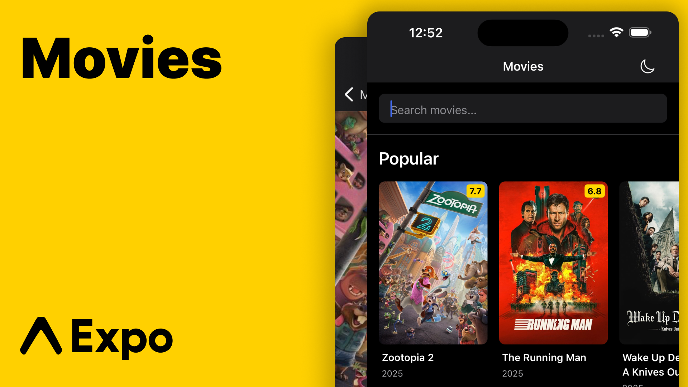

# Collars Movies

<div style="text-align: center;">

</div>

A React Native mobile application built with Expo SDK 54 that displays Popular and Upcoming movies from TMDB (The Movie Database) with offline save functionality.

## Design

UI/UX design and specifications are available in [Figma](https://www.figma.com/design/ItmNiEAICLaWCUdaODyf37/Movies-App?node-id=1-2084&t=1SmVaYYOd7mjWkZG-1).


## Features

- **Movies Tab**: Browse Popular, Upcoming, and Top Rated movies in horizontal carousels
- **Search**: Real-time movie search with 400ms debounce and filters (year, genre, language)
- **Movie Details**: Rich movie information including poster, rating, genres, runtime, and overview
- **Play Trailers**: Watch movie trailers directly from the detail screen (YouTube/Vimeo)
- **Save Movies**: Save movies for offline viewing with haptic feedback
- **Sync to TMDB**: Automatically sync saved movies to TMDB Lists API (optional, requires session_id)
- **Saved Tab**: View all saved movies with full offline support
- **Dark Mode**: Hybrid theme system (System/Light/Dark) with manual toggle
- **Error Handling**: Comprehensive error handling with retry functionality
- **Pull to Refresh**: Refresh movie lists with pull-to-refresh gesture

## Prerequisites

- **Node.js 20+** (22+ recommended)
- **npm** or **yarn**
- **Expo CLI** (installed globally or via npx)
- **Ruby 3.0+** (required for iOS builds with CocoaPods)
  - Only needed if running `npx expo run:ios` or building native apps
  - Not required for Expo Go development
  - Check version: `ruby --version`
- **TMDB API key** ([Get one here](https://www.themoviedb.org/settings/api))
- **EAS CLI** (for building - optional but recommended)
  - Install: `npm install -g eas-cli`

## Setup

1. **Clone and install dependencies**:
   ```bash
   npm install
   ```

2. **Create environment file**:
   Create a `.env` file in the root directory:
   ```env
   EXPO_PUBLIC_TMDB_API_KEY=your_api_key_here
   EXPO_PUBLIC_TMDB_BASE_URL=https://api.themoviedb.org/3
   EXPO_PUBLIC_TMDB_IMAGE_BASE_URL=https://image.tmdb.org/t/p/w500
   ```

3. **Start the development server**:
   ```bash
   npm start
   ```

4. **Run on device/simulator**:
   - Press `i` for iOS simulator
   - Press `a` for Android emulator
   - Scan QR code with Expo Go app on physical device

## Advanced Features

### Play Movie Trailers

The app supports playing movie trailers from YouTube and Vimeo. When viewing a movie detail, if a trailer is available, a "Play Trailer" button will appear. Tapping it opens the trailer in your default browser.

**Implementation**:
- Fetches videos from TMDB `/movie/{id}/videos` endpoint
- Filters for trailers from YouTube/Vimeo
- Opens in browser using `Linking.openURL()`

### Sync Saved Movies to TMDB Lists (Optional)

The app can sync your saved movies to a TMDB List, allowing you to access them from any device or the TMDB website.

**Setup** (Optional):
1. Get a TMDB session ID:
   - Authenticate with TMDB API (requires user account)
   - Obtain a `session_id` from TMDB authentication flow
2. Store the session ID:
   ```javascript
   // In your app code or via a settings screen
   await AsyncStorage.setItem('@collars_movies:tmdb_session_id', 'your_session_id');
   ```

**How it works**:
- When you save a movie, it's stored locally first
- If a `session_id` is available, the app creates/uses a TMDB List
- Saved movies are automatically synced to the TMDB List
- Works offline: operations are queued and synced when online

**Note**: Without a `session_id`, the app works in local-only mode, storing movies only on the device.

## Testing

### Unit Tests

Run unit tests with:
```bash
npm test
```

Run tests in watch mode:
```bash
npm run test:watch
```

### End-to-End Tests

E2E tests are located in the `e2e/` directory and use [Maestro](https://maestro.mobile.dev/).

**Prerequisites**:
1. Install Maestro: `curl -Ls "https://get.maestro.mobile.dev" | bash`
2. Build the app: 
   - iOS: `npx expo run:ios` (requires Ruby 3.0+)
   - Android: `npx expo run:android`

**Run E2E tests**:
```bash
# Run all tests
npm run test:e2e

# Run for iOS
npm run test:e2e:ios

# Run for Android
npm run test:e2e:android

# Run a specific test
maestro test e2e/01-navigation.yaml
```

See `e2e/README.md` for detailed documentation.

## Architecture

### Directory Structure

```
src/
├── app/                    # Application layer
│   ├── navigation/         # Navigation configuration
│   ├── screens/            # Screen components
│   └── components/         # Reusable UI components
├── domain/                 # Domain layer (business logic)
│   └── movie/              # Movie domain models
├── infrastructure/         # Infrastructure layer
│   ├── api/                # TMDB API client
│   └── storage/            # AsyncStorage persistence
├── hooks/                  # Custom React hooks
├── ui/                     # UI theme system
│   └── theme/              # Colors, spacing, typography
└── utils/                  # Utility functions
```

### Architecture Decisions

**Clean Architecture**: The app follows a layered architecture separating concerns:
- **Domain Layer**: Pure business logic, no dependencies on frameworks
- **Infrastructure Layer**: External concerns (API, storage)
- **Application Layer**: UI components and navigation
- **Hooks Layer**: React-specific data fetching and state management

**Benefits**:
- Easy to test (domain logic isolated)
- Easy to swap implementations (e.g., different storage backend)
- Clear separation of concerns
- Type-safe throughout

### Navigation Layout

The app uses React Navigation v7 with a bottom tab navigator containing two stacks:

```
RootTabs (Bottom Tabs)
├── MoviesTab
│   └── MoviesStack
│       ├── Movies (list screen)
│       └── MovieDetail (shared detail screen)
└── SavedTab
    └── SavedStack
        ├── Saved (list screen)
        └── MovieDetail (shared detail screen)
```

**Design Choice**: Each tab has its own stack to maintain navigation history independently. The `MovieDetail` screen is shared but exists in both stacks, allowing users to navigate back to the correct tab context.

### Offline Strategy

**Saved Movies Storage**:
- Movies are saved as normalized `SavedMovie` objects containing all fields needed for offline rendering
- Uses `@react-native-async-storage/async-storage` for persistence
- Saved movies include: `id`, `title`, `posterUrl`, `overview`, `rating`, `releaseDate`, `genres[]`, `runtime`, `language`, `savedAt`

**Offline-First Detail View**:
- `useMovieDetail` hook checks saved movies first before attempting API fetch
- If API fails but saved data exists, uses saved data
- If no saved data and API fails, shows error with retry option
- This ensures saved movies are always viewable offline, even after app restart

**Network Detection**:
- Uses `@react-native-community/netinfo` to monitor connectivity
- `useNetworkStatus` hook provides real-time network status
- UI adapts based on connectivity (shows offline indicator, prevents API calls)

**Image Caching**:
- Movie posters are cached locally using `expo-file-system`
- Images are downloaded and stored when online
- Cached images are used automatically when offline
- Cache persists across app restarts

**Sync Queue**:
- Operations (save/remove movies) are queued when offline
- Queue is automatically processed when network becomes available
- Retry mechanism with max retries to handle transient failures
- Ensures data consistency even with intermittent connectivity

**Trade-offs**:
- ✅ Full offline support for saved movies
- ✅ Graceful degradation when network unavailable
- ✅ Image caching for offline viewing
- ✅ Automatic sync when connectivity restored
- ⚠️ Saved movies may become stale (no auto-refresh)
- ⚠️ Storage limited by device capacity (not a concern for typical use)
- ⚠️ Image cache grows over time (can be cleared manually)

### Error Handling Strategy

**Centralized Error Management**:
- All TMDB API errors are mapped to `TMDBError` with specific error codes
- Error codes: `UNAUTHORIZED`, `NOT_FOUND`, `RATE_LIMIT`, `SERVER_ERROR`, `NETWORK_ERROR`, `TIMEOUT`
- User-friendly messages displayed in UI
- Technical details logged via logger utility

**Error Recovery**:
- All error states provide retry functionality
- Network errors show clear messaging
- Rate limit errors guide users to wait
- Server errors indicate temporary issues

**Trade-offs**:
- ✅ Consistent error handling across app
- ✅ User-friendly messages
- ⚠️ Some error details hidden from users (by design for UX)

### UI/UX Decisions

**List Presentation**:
- **Popular/Upcoming**: Horizontal carousels in vertical scroll
- **Rationale**: Better for browsing large collections, familiar mobile pattern
- **Alternative Considered**: SectionList with horizontal lists - similar UX, chose simpler implementation

**Performance Optimizations**:
- `FlatList` with `initialNumToRender`, `windowSize`, `removeClippedSubviews`
- `React.memo` for `MovieCard` component
- Debounced search (400ms) to reduce API calls
- Image caching via `expo-image`

**Theming**:
- Hybrid theme system: Manual toggle (Light/Dark) + System preference option
- All colors via theme tokens (validated - no hardcoded colors)
- Theme preference persisted in AsyncStorage
- Smooth transitions between themes
- Toggle accessible from navigation header

## Trade-offs & Decisions

### TypeScript Strict Mode
- **Decision**: Enabled strict mode for type safety
- **Trade-off**: More verbose but catches errors at compile time
- **Benefit**: Prevents runtime errors, better IDE support, no `any` types used

### No State Management Library
- **Decision**: Use React hooks + custom hooks for state management
- **Trade-off**: Simpler for this app size, but could scale to Redux/Zustand if needed
- **Benefit**: Less boilerplate, easier to understand, sufficient for current complexity
- **Note**: Custom hooks (`useMovies`, `useMovieDetail`, `useSavedMovies`) encapsulate all state logic

### AsyncStorage for Persistence
- **Decision**: Use AsyncStorage for saved movies and theme preference
- **Trade-off**: Not suitable for large datasets (>10MB), but sufficient for user's saved movies
- **Benefit**: Simple, no external dependencies, works offline, built into React Native
- **Alternative Considered**: SQLite (overkill for this use case), Realm (adds complexity)

### Horizontal Carousels vs Vertical List
- **Decision**: Horizontal carousels for Popular/Upcoming/Top Rated
- **Trade-off**: More vertical scrolling, but better for browsing large collections
- **Alternative Considered**: SectionList with horizontal sections - similar UX, chose simpler FlatList implementation
- **Top Rated**: Special treatment with larger cards and ranking overlay (top 10 only)

### Search Implementation
- **Decision**: Replace sections with search results when query active
- **Trade-off**: Can't see popular/upcoming while searching
- **Benefit**: Cleaner UI, focused search experience, reduces cognitive load
- **Filters**: Only shown when search results are active (year, genre, language)
- **Debounce**: 400ms to balance responsiveness and API call reduction

### Video Player Implementation
- **Decision**: Use WebView with YouTube watch URL format (after error 153)
- **Trade-off**: Opens in WebView instead of native player, but works reliably
- **Benefit**: Avoids YouTube embedding restrictions, supports YouTube/Vimeo
- **Alternative Considered**: Native video player (expo-av) - requires direct video URLs, not available from TMDB

### Offline-First Strategy
- **Decision**: Prioritize saved data over API calls when offline
- **Trade-off**: Saved movies may become stale, but always accessible offline
- **Benefit**: Full offline functionality, no network required for saved content
- **Sync Queue**: Operations queued when offline, synced automatically when online
- **Image Caching**: Posters cached locally for offline viewing

### Network Status Detection
- **Decision**: Single shared context (`NetworkStatusContext`) instead of multiple subscriptions
- **Trade-off**: Slight overhead of context provider, but prevents multiple NetInfo subscriptions
- **Benefit**: Single source of truth, better performance, consistent state across app
- **Implementation**: Uses `@react-native-community/netinfo` with shared subscription

### TMDB Lists API Sync (Optional)
- **Decision**: Implement sync queue with optional TMDB Lists API integration
- **Trade-off**: Requires user authentication (session_id), but works in local-only mode without it
- **Benefit**: Can sync across devices if authenticated, graceful fallback to local-only
- **Implementation**: Queue-based system that syncs when online and authenticated

### Animation Library
- **Decision**: Use React Native Reanimated v4 for all animations
- **Trade-off**: Requires native build (not available in Expo Go), but provides smooth 60fps animations
- **Benefit**: Runs on UI thread (multi-threading), smooth performance, declarative API
- **Usage**: Subtle animations (scale on press, fade transitions) following professional UX guidelines

### Testing Strategy
- **Decision**: Unit tests for business logic (mappers, hooks) + E2E tests with Maestro
- **Trade-off**: Not 100% coverage, but covers critical paths and user flows
- **Benefit**: Fast unit tests, comprehensive E2E tests, maintainable test suite
- **Coverage**: Mappers (DTO → Domain), hooks (success/error cases), E2E (all major user flows)

### Theme Token Validation
- **Decision**: Use design tokens exclusively, no hardcoded values
- **Trade-off**: More setup initially, but ensures consistency
- **Benefit**: Easy theme switching, consistent design, maintainable
- **Validation**: All hardcoded colors/fonts replaced with theme tokens (documented in `THEME_VALIDATION.md`)

## Manual QA Checklist

### Movies Tab
- [ ] Popular movies load and display correctly
- [ ] Upcoming movies load and display correctly
- [ ] Movie cards show poster, title, rating, year
- [ ] Tapping movie navigates to detail screen
- [ ] Pull-to-refresh works
- [ ] Search bar appears at top
- [ ] Search debounces correctly (400ms)
- [ ] Search results replace sections when query active
- [ ] Empty search shows appropriate message
- [ ] Error state shows with retry button
- [ ] Loading skeleton appears on initial load

### Movie Detail Screen
- [ ] Hero poster displays correctly
- [ ] All movie information displays (title, rating, year, overview, genres, runtime, language)
- [ ] Overview expand/collapse works
- [ ] Save button toggles correctly
- [ ] Haptic feedback on save/remove
- [ ] Saved state persists after navigation
- [ ] Works offline for saved movies
- [ ] Error state with retry works

### Saved Tab
- [ ] Displays all saved movies
- [ ] Movie cards match Movies tab style
- [ ] Tapping movie navigates to detail
- [ ] Detail screen works offline
- [ ] Empty state shows when no saved movies
- [ ] Pull-to-refresh works
- [ ] Updates when movie saved from detail screen

### Theming
- [ ] Light mode displays correctly
- [ ] Dark mode displays correctly
- [ ] Theme switches with system preference
- [ ] No hardcoded colors visible

### Error Handling
- [ ] Network error shows friendly message
- [ ] 401 error shows API key message
- [ ] 404 error shows not found message
- [ ] 429 error shows rate limit message
- [ ] Retry button works on all errors

### Offline Testing
- [ ] Save movie while online
- [ ] Turn off network
- [ ] Navigate to Saved tab
- [ ] Open saved movie detail
- [ ] Verify all information displays
- [ ] Restart app
- [ ] Verify saved movies persist
- [ ] Verify detail screen works offline

## Commands

```bash
# Install dependencies
npm install

# Start development server
npm start

# Run on iOS
npm run ios

# Run on Android
npm run android

# Run tests
npm test

# Run tests in watch mode
npm run test:watch
```

## Environment Variables

Required environment variables (set in `.env`):
- `EXPO_PUBLIC_TMDB_API_KEY`: Your TMDB API key
- `EXPO_PUBLIC_TMDB_BASE_URL`: TMDB API base URL (default: https://api.themoviedb.org/3)
- `EXPO_PUBLIC_TMDB_IMAGE_BASE_URL`: TMDB image base URL (default: https://image.tmdb.org/t/p/w500)

## Building & Delivery

### Quick Start with EAS Build (Recommended)

1. **Install EAS CLI**:
   ```bash
   npm install -g eas-cli
   ```

2. **Login to Expo**:
   ```bash
   eas login
   ```

3. **Build Android APK**:
   ```bash
   eas build --platform android --profile preview
   ```

4. **Share the download link** provided by EAS

### Alternative: Local Build

**Android**:
```bash
npx expo run:android
# APK will be in: android/app/build/outputs/apk/debug/app-debug.apk
```

**iOS** (requires Xcode):
```bash
npx expo run:ios
```

### Configuration

The project includes `eas.json` with build profiles. For EAS builds, you may need to configure environment variables:

```bash
# Option 1: Add to eas.json (less secure)
# Option 2: Use EAS secrets (recommended)
eas secret:create --scope project --name EXPO_PUBLIC_TMDB_API_KEY --value your_api_key
```

## License

Private project for take-home assessment.

